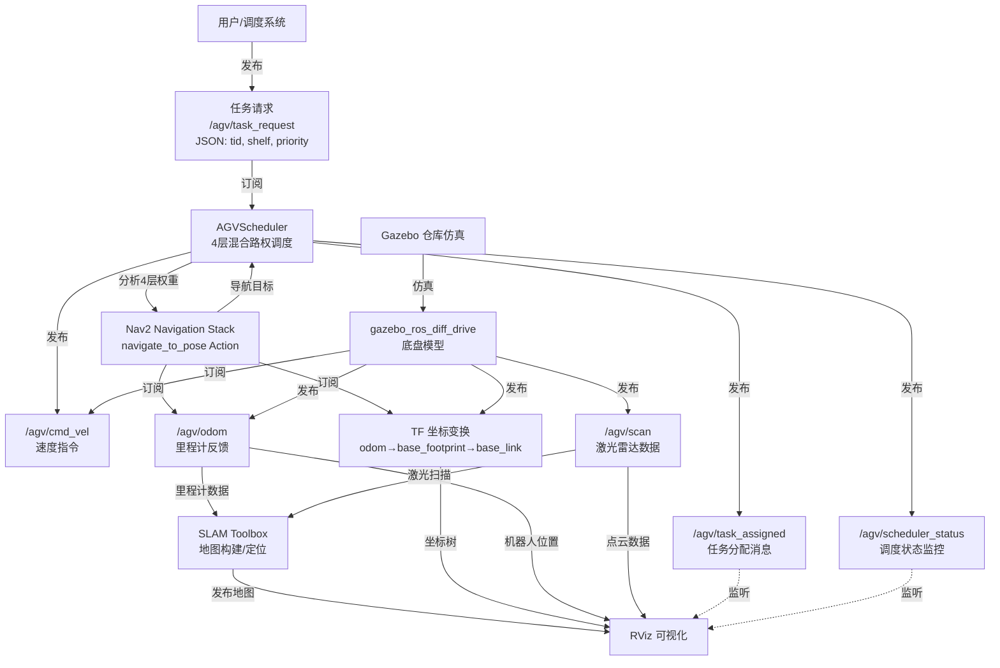
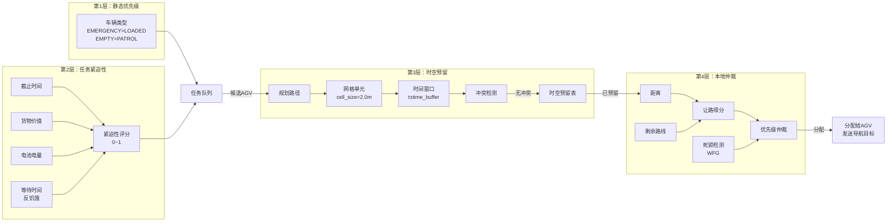
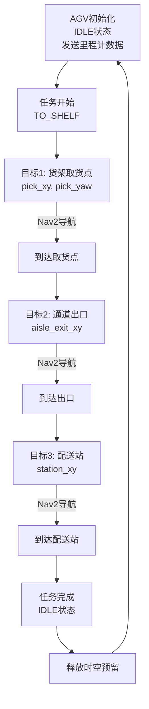
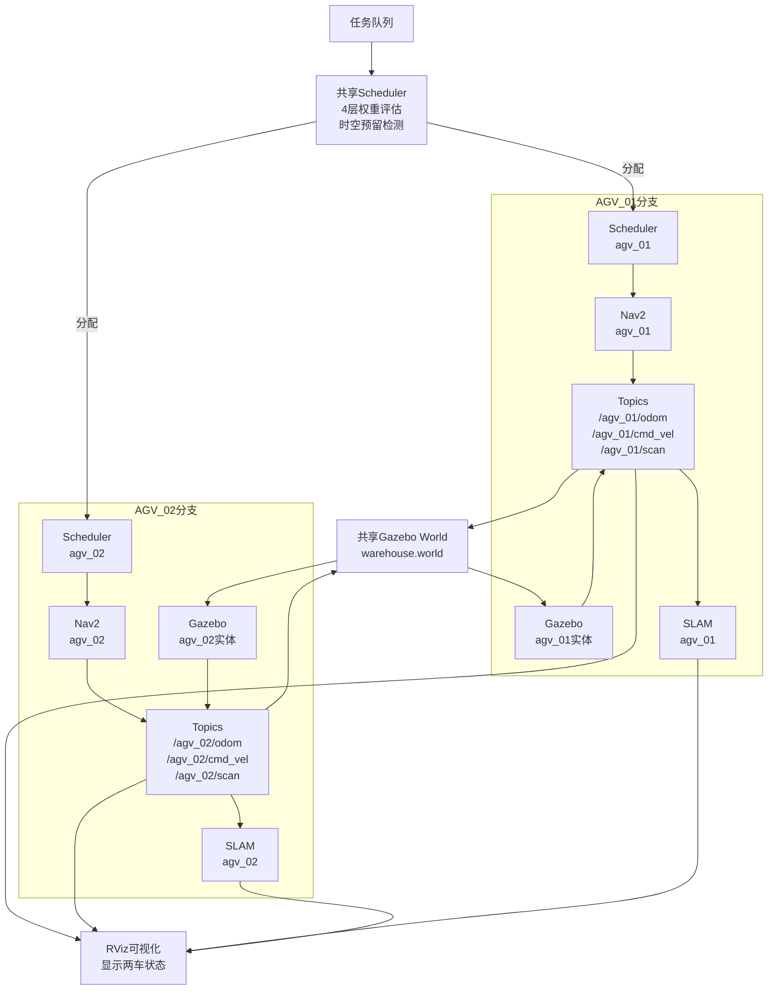
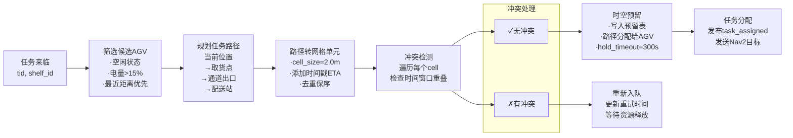
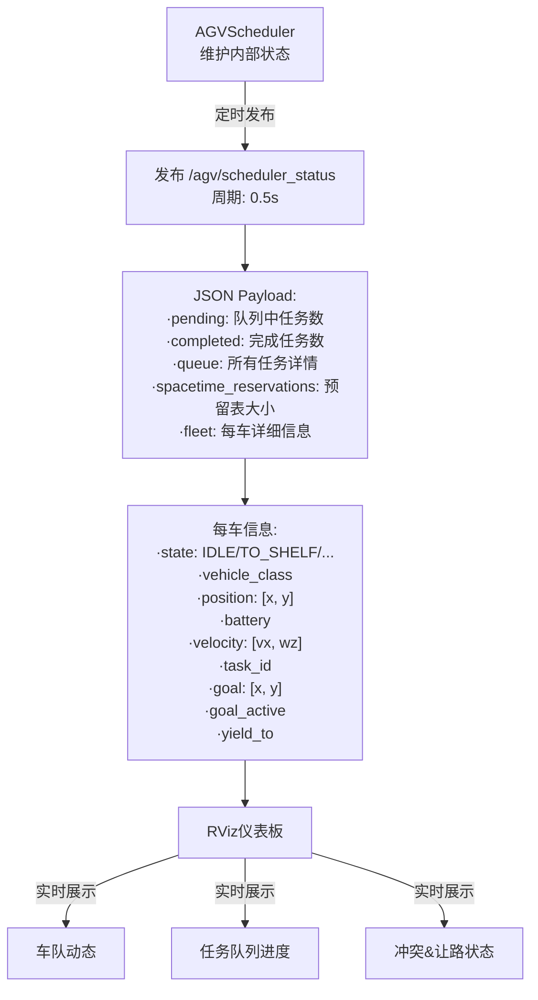
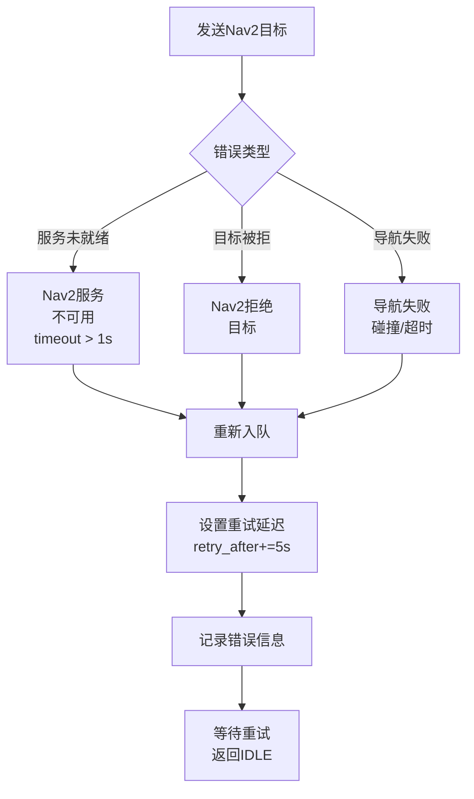
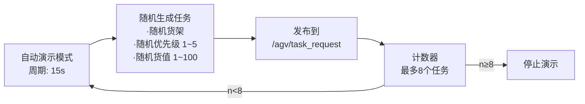
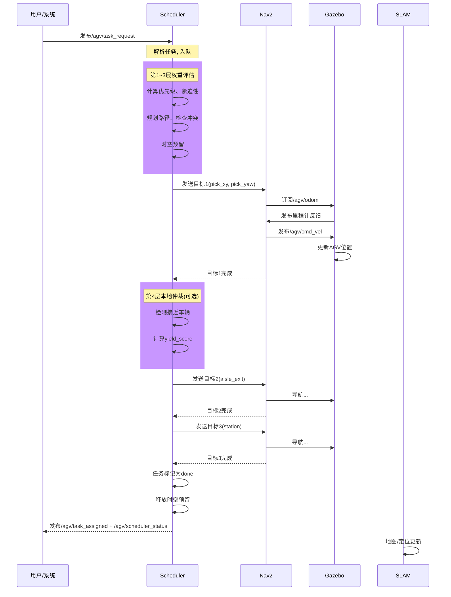
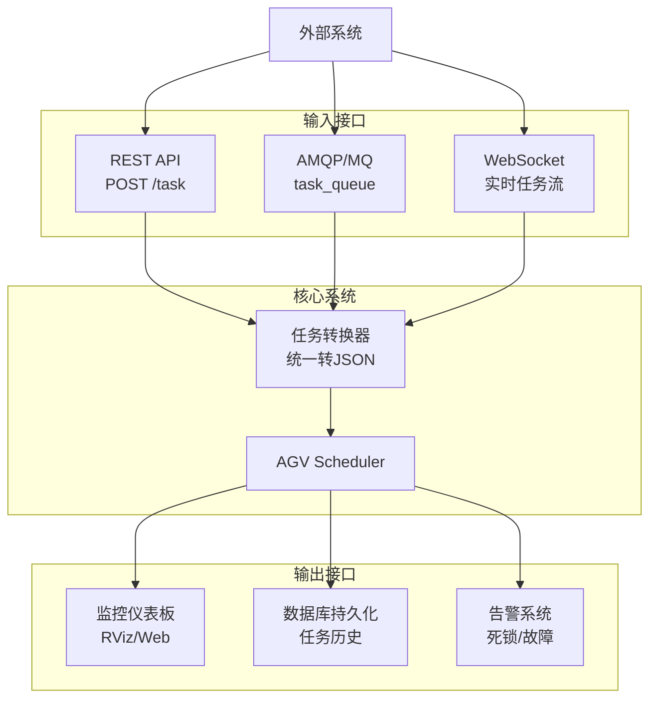

# AGV 仓储系统数据流图

## 整体系统数据流



---

## 详细数据流：任务处理管道



---

## 单车任务执行流



---

## ROS 2 Topic/Action 完整映射

### 订阅关系

```
agv_scheduler:
  ├── 订阅 /agv/task_request (std_msgs/String)
  │   └── 来源：用户/外部调度
  ├── 订阅 /agv/odom (nav_msgs/Odometry)
  │   ├── 来源：gazebo_ros_diff_drive
  │   └── 用途：更新AGV位置、速度
  ├── 订阅 /agv/agv_status (std_msgs/String)
  │   ├── 来源：AGV状态发布器
  │   └── 用途：更新电池、状态
  └── Action客户端
      └── /agv/navigate_to_pose (nav2_msgs/NavigateToPose)
          └── 来源：Nav2 navigation stack

nav2_stack:
  ├── 订阅 /agv/odom (nav_msgs/Odometry)
  │   └── 来源：gazebo_ros_diff_drive
  ├── 订阅 /agv/scan (sensor_msgs/LaserScan)
  │   └── 来源：Gazebo laser plugin
  ├── 订阅 TF: odom -> base_footprint -> base_link
  │   └── 来源：robot_state_publisher + gazebo_ros
  └── 发布 /agv/cmd_vel (geometry_msgs/Twist)
      └── 目标：gazebo_ros_diff_drive

slam_toolbox:
  ├── 订阅 /agv/scan (sensor_msgs/LaserScan)
  │   └── 来源：Gazebo laser plugin
  ├── 订阅 /agv/odom (nav_msgs/Odometry)
  │   └── 来源：gazebo_ros_diff_drive
  └── 发布地图及TF

rviz2:
  ├── 订阅 /agv/task_assigned (std_msgs/String)
  ├── 订阅 /agv/scheduler_status (std_msgs/String)
  ├── 订阅 /agv/odom (nav_msgs/Odometry)
  ├── 订阅 /agv/scan (sensor_msgs/LaserScan)
  └── 订阅 TF树
```

### 发布关系

```
agv_scheduler (发布):
  ├── /agv/task_assigned (std_msgs/String)
  │   └── JSON: agv, tid, shelf, pick, drop, vehicle_class
  ├── /agv/scheduler_status (std_msgs/String)
  │   └── JSON: pending, completed, queue, fleet, spacetime_reservations
  └── /agv/cmd_vel (geometry_msgs/Twist)
      └── 紧急制动指令

gazebo_ros_diff_drive (发布):
  ├── /agv/odom (nav_msgs/Odometry)
  │   └── 位置: x, y, theta; 速度: vx, wz
  ├── /agv/scan (sensor_msgs/LaserScan)
  │   └── 激光雷达360度扫描
  └── TF: odom, base_footprint, base_link

nav2_stack (发布):
  ├── /agv/cmd_vel (geometry_msgs/Twist)
  │   └── 导航控制速度
  └── Action反馈: navigate_to_pose

robot_state_publisher (发布):
  └── TF: base_link及其所有子link
```

---

## 多车场景数据流



---

## 时空预留与冲突检测流



---

## 4层权重计算详解

### 第1层：静态优先级（Layer-1）

```
Vehicle Class Priority:
  EMERGENCY  = 4  (最高)
  LOADED     = 3  (满载
  EMPTY      = 2  (空载)
  PATROL     = 1  (最低)
  
static_score = vehicle_class.value * 10
```

### 第2层：任务紧迫性（Layer-2）

```
urgency_score = 0.35×deadline_score + 0.25×value_score + 0.20×battery_score + 0.20×wait_score

deadline_score:
  - 计算距截止时间秒数
  - 窗口: 600s(10分钟)
  - 分数范围: [0, 1]

value_score:
  - 货物价值 / 100
  - 范围: [0, 1]

battery_score:
  - (50.0 - agv_battery) / 50.0
  - 低电量→高分
  - 范围: [0, 1]

wait_score:
  - min(waited_seconds / 300s, 1.0)
  - 防止任务饥饿
  - 范围: [0, 1]
```

### 第3层：时空预留（Layer-3）

```
SpacetimeSlot {
  agv_id,
  task_id,
  cell_key: "c:gx:gy",
  t_start: timestamp - time_buffer,
  t_end: timestamp + time_buffer,
  expires_at: timestamp + hold_timeout
}

冲突判定:
  if cell_overlaps AND time_window_overlaps:
    conflict = True
```

### 第4层：本地仲裁（Layer-4）

```
yield_score = static_priority*10 + urgency*5 - reverse_cost*2

当两车接近(dist < safety_stop_distance):
  - 计算双方yield_score
  - 低分AGV让路
  - 让路AGV: 取消目标, 重新入队, 等待retry_delay=8s

死锁检测(Wait-For Graph):
  - 构建等待图: {agv_id: waiting_for_agv_id}
  - DFS检测环
  - 找到环中最低分AGV, 抢占其任务
```

---

## 实时监控与状态发布



---

## 错误处理与恢复流



---

## 自动演示模式



---

## 系统时序图：完整任务生命周期



---

## Topic消息格式详解

### /agv/task_request

```json
{
  "tid": "T1001",              // 任务ID
  "shelf": "A1",               // 货架号
  "priority": 5,               // 用户优先级 1~10
  "cargo_value": 50.5,         // 货物价值 (可选)
  "deadline": 1234567890.5,    // Unix timestamp (可选)
  "agv_id": "agv_01"           // 指定AGV (可选)
}
```

### /agv/task_assigned

```json
{
  "agv": "agv_01",
  "tid": "T1001",
  "shelf": "A1",
  "shelf_center": [-9.0, 7.0],
  "pick": [-9.0, 5.0],
  "pick_yaw": 1.5708,
  "aisle_exit": [5.5, 5.0],
  "drop": [6.4, 0.0],
  "priority": 5,
  "cargo_value": 50.5,
  "deadline": 0.0,
  "vehicle_class": "EMPTY",
  "nav_action": "navigate_to_pose"
}
```

### /agv/scheduler_status

```json
{
  "pending": 3,
  "completed": 5,
  "queue": [
    {
      "tid": "T1002",
      "shelf": "B2",
      "status": "pending",
      "requested_agv": "",
      "retry_in": 0.0,
      "last_error": "",
      "cargo_value": 30.0,
      "deadline": 0.0
    }
  ],
  "spacetime_reservations": 45,
  "fleet": {
    "agv_01": {
      "state": "to_shelf",
      "vehicle_class": "EMPTY",
      "pos": [-5.2, 3.1],
      "battery": 85.5,
      "vx": 0.45,
      "wz": 0.02,
      "task": "T1001",
      "nav_action": "navigate_to_pose",
      "yield_to": "",
      "goal": [-9.0, 5.0],
      "goal_active": true
    }
  }
}
```

---

## 性能指标监控点

```
关键性能指标(KPI):
  1. 任务吞吐量: 已完成任务数/小时
  2. 平均等待时间: (完成时间 - 请求时间)
  3. 冲突率: 触发重新入队次数 / 总任务数
  4. 死锁事件: 检测到死锁环数
  5. 车辆利用率: 运行时间 / 总时间
  6. 路径重规划次数: 导航失败重试次数
  7. 时空预留表大小: 监控内存使用
  8. 调度循环延迟: 任务发现→分配时间

监控点:
  - Scheduler: _sched_loop (1.0s)
  - Safety: _safety_loop (0.2s)
  - Watchdog: _nav_watchdog (1.0s)
  - Deadlock: _deadlock_check (2.0s周期)
  - Status: _pub_status (0.5s)
```

---

## 扩展与集成接口



---

**更新日期**: 2026-05-07  
**系统架构**: ROS 2 + Nav2 + SLAM Toolbox + Gazebo  
**关键组件**: AGV Scheduler (4层混合路权) | Nav2 Navigation | gazebo_ros (仿真底座)
